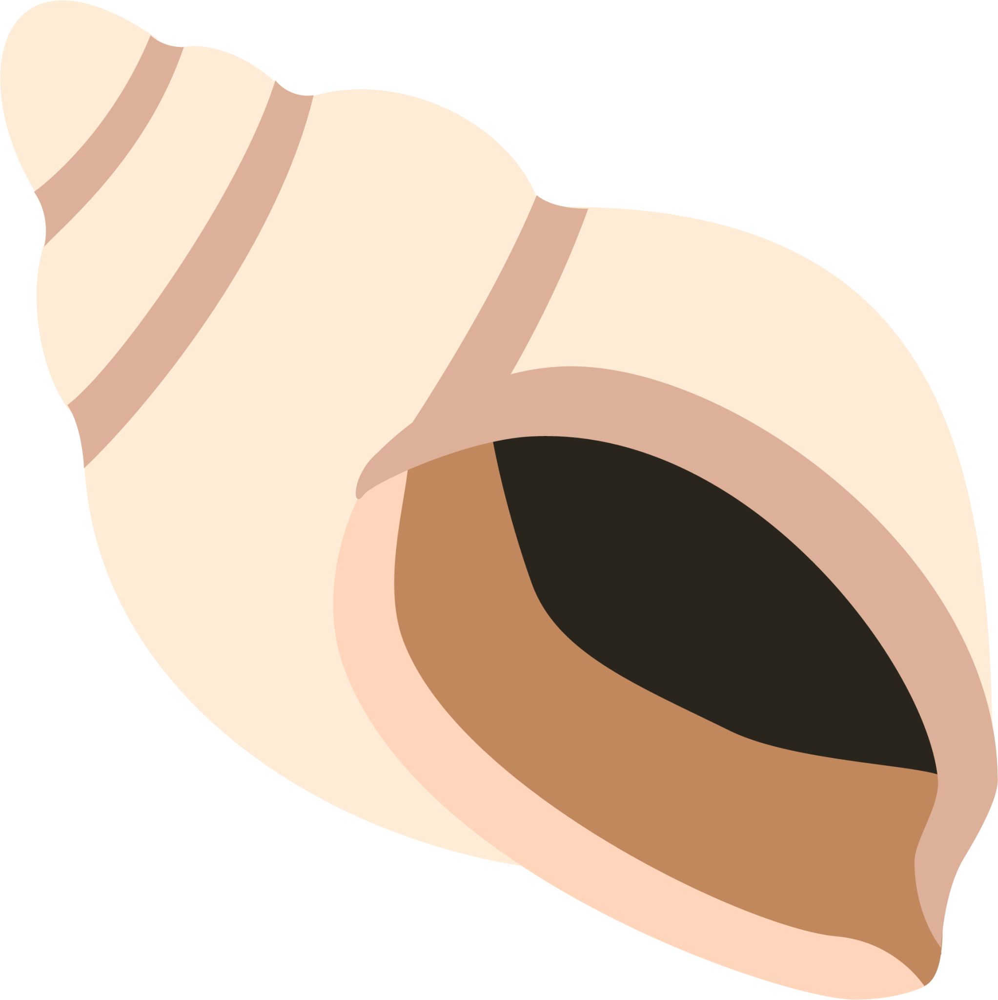

# YaSH🐚 - Yet Another SHell

yash is an attempt to bring the world of Emojis to the shell.

## Philosophy

Nihilism.

## So Far...

### Commands

- ❌ - exit
- 😺 - cat
- 🤔 - whoami
- 🔍,🔎 - whereis
- 🗣️ - echo
- 🤬 - echo
- 😱 - echo (but spooky)
- 👀 - ls
  - 🔬 - a
  - 👓 - l
  - 👶 - h
- 🔨,⚒️,🛠️,🏗️ - pwd
- 🏃,📦 - cd
- 🗑️ - rm
  - ➰ - -r
  - 💪 - -f
- 📔, 📓 - vim
- 🤢 - emacs

### Tools

- 👉 - redirection
- 🪈 - pipe

### Options

- 🆘 - --help

## Here's a shell :0

